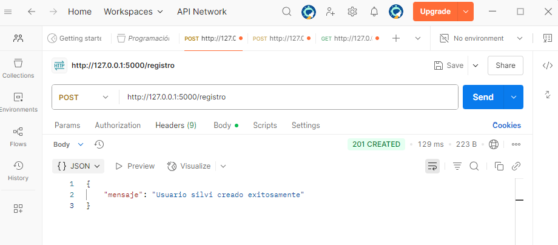
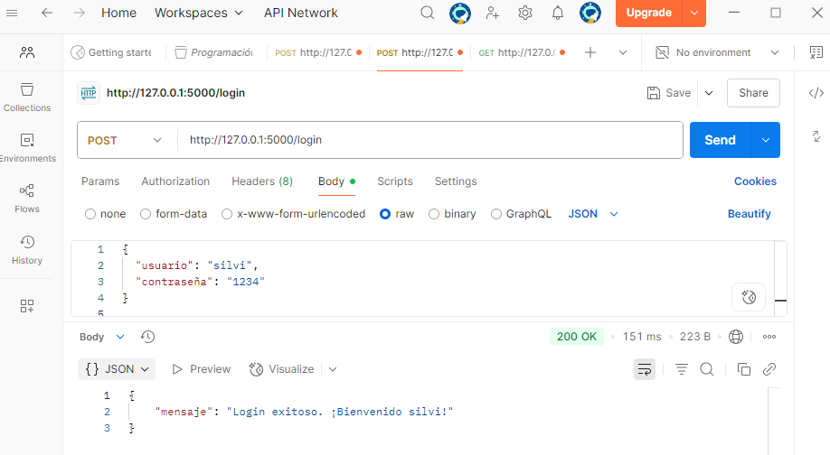
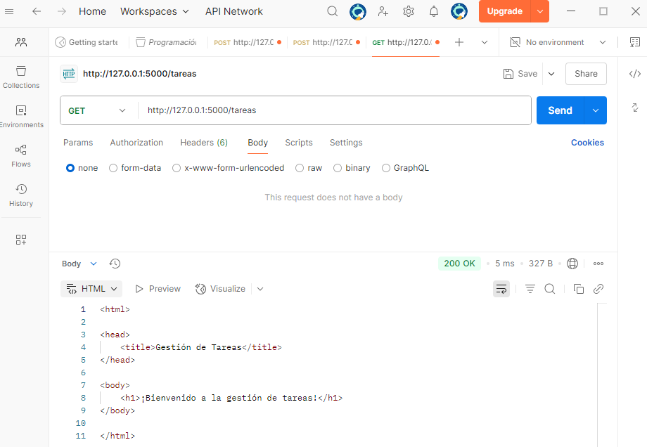

# 🗂️ Sistema de Gestión de Tareas (API Flask + SQLite)

**Proyecto desarrollado para la asignatura _Programación en Redes_ de la Tecnicatura en Desarrollo de Software (IFTS).**

Esta API REST en Python utiliza Flask y SQLite para gestionar usuarios con contraseñas seguras y tareas básicas.  
Permite registrar usuarios, iniciar sesión y visualizar una página de bienvenida.  
Los datos se almacenan localmente en SQLite, y las pruebas se realizan mediante Postman o cliente en consola.

⚠️ _Nota:_ La API se ejecuta localmente con Flask y no puede desplegarse en GitHub Pages, que solo soporta sitios estáticos.

El repositorio contiene el código fuente, documentación detallada y capturas de pruebas exitosas.


---

## 🎯 Objetivos del trabajo

- 🚀 Implementar una API REST con endpoints funcionales  
- 🔐 Usar autenticación básica con protección de contraseñas (hash)  
- 💾 Gestionar datos persistentes con SQLite  
- 🛠️ Construir un cliente en consola o Postman para interactuar con la API  

---

## 🛠️ Tecnologías utilizadas

- 🐍 Python 3.x  
- ⚙️ Flask 3.1.1  
- 🗄️ Flask-SQLAlchemy  
- 🔐 Werkzeug.security  
- 🗂️ SQLite  
- 📫 Cliente de pruebas: Postman  

---

## 🖥️ Instalación y ejecución del proyecto

### 📌 1️⃣ Clonar el repositorio o descargar el código fuente

### 📌 2️⃣ Crear y activar el entorno virtual

```bash
python -m venv venv  
venv\Scripts\activate  # En Windows
```

### 📌 3️⃣ Instalar las dependencias

```bash
pip install Flask==3.1.1 Flask-SQLAlchemy
```

### 📌 4️⃣ Ejecutar el servidor

```bash
python servidor.py
```

### El servidor se ejecutará en: http://127.0.0.1:5000/

## 🔗 Endpoints de la API

### 🔸 1️⃣ POST `/registro`

Registrar un nuevo usuario.

**Request (Body - JSON):**

```json
{
  "usuario": "nombre",
  "contraseña": "1234"
}
```
**Respuestas posibles:**

- ✅ `201 Created` → Usuario creado exitosamente  
- ⚠️ `400 Bad Request` → Faltan datos o el usuario ya existe  

### 🔸 2️⃣ POST `/login`

Verificar credenciales de usuario.

**Request (Body - JSON):**

```json
{
  "usuario": "nombre",
  "contraseña": "1234"
}
```
**Respuestas posibles:**

- ✅ `200 OK` → Login exitoso  
- 🚫 `401 Unauthorized` → Usuario o contraseña incorrectos  

### 🔸 3️⃣ GET `/tareas`

Retorna una página HTML de bienvenida.

**Ejemplo de respuesta:**

```html
<html>
<head><title>Gestión de Tareas</title></head>
<body>
<h1>¡Bienvenido a la gestión de tareas!</h1>
</body>
</html>
```
## 📚 Conceptos

### 🔐 ¿Por qué hashear contraseñas?

Porque almacenar contraseñas en texto plano es extremadamente inseguro.  
Si la base de datos fuera comprometida, las contraseñas hasheadas no pueden ser leídas directamente, ya que el hash es un valor irreversible.  
Esto protege la privacidad y seguridad de los usuarios.

### 💾 Ventajas de usar SQLite en este proyecto

- Es una base de datos **ligera** y simple de usar  
- No requiere un servidor de base de datos externo  
- Perfecta para pequeños proyectos o prototipos  
- Los datos se almacenan en un archivo local (`usuarios.db`)  
- Fácil de integrar con Flask a través de SQLAlchemy  

## 📸 Capturas de pruebas exitosas

Aquí se muestran algunas pruebas realizadas con Postman:

---

### Registro de usuario (`POST /registro`)



---

### Login exitoso (`POST /login`)



---

### Visualización de tareas (`GET /tareas`)



---

## 🚀 Notas sobre despliegue en GitHub Pages 

- Este proyecto es una API Flask, por lo tanto se ejecuta en un servidor local (localhost).
- GitHub Pages solo aloja sitios estáticos (HTML, CSS, JS), por lo que la API no se puede desplegar allí.
- El código fuente y la documentación se suben al repositorio de GitHub para su entrega.
- Para desplegar la API, es necesario un servidor o plataforma que soporte Flask (por ejemplo, Heroku, AWS, etc.).


## 👩‍💻 Autora

Silvina Villanueva  

IFTS 29 - Tecnicatura en Desarrollo de Software 

Asignatura: Programación sobre Redes - Profesor Alan Portillo

3 año - Com.B


