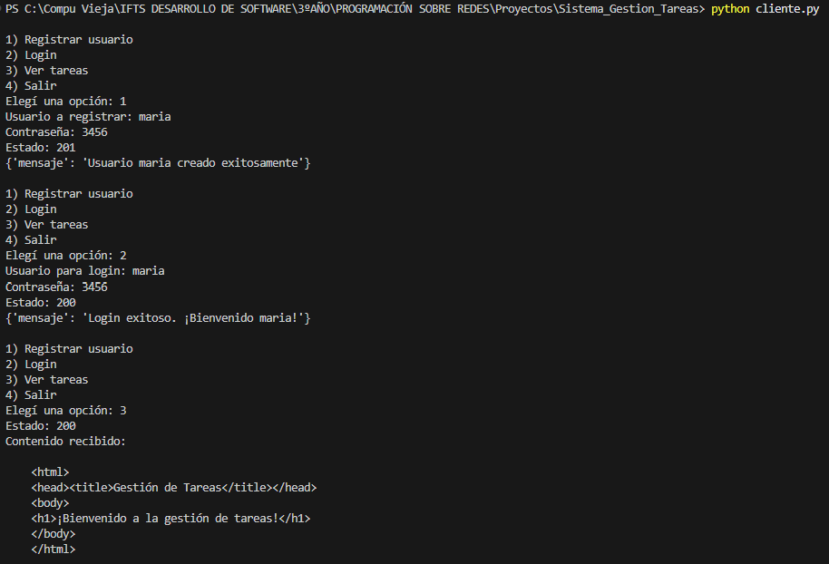
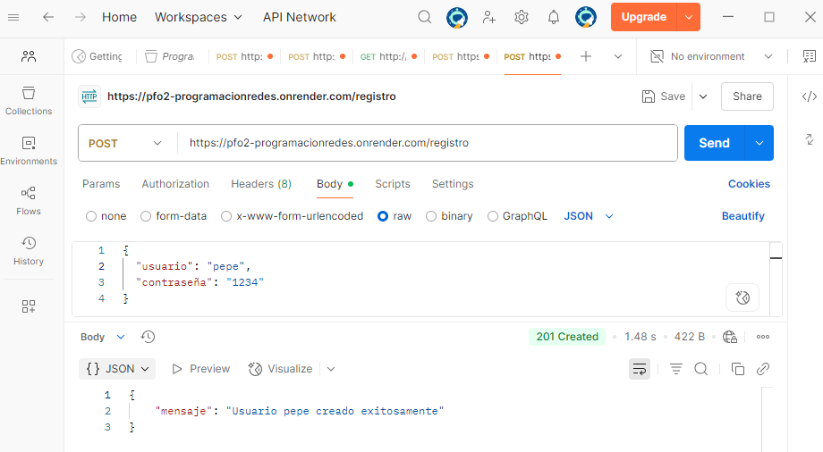
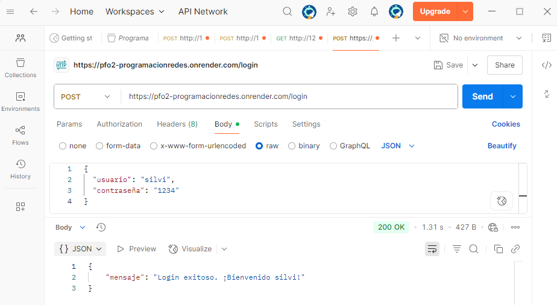
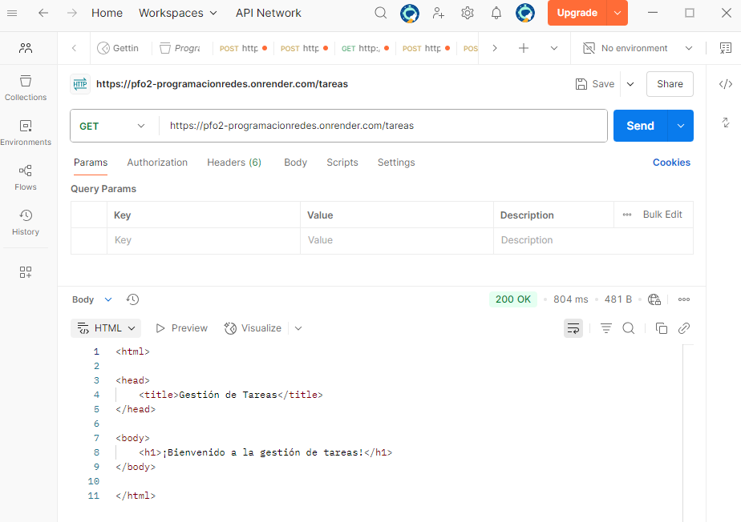

# 🗂️ Sistema de Gestión de Tareas (API Flask + SQLite)

**Proyecto desarrollado para la asignatura _Programación sobre Redes_ de la Tecnicatura en Desarrollo de Software (IFTS).**

Esta API REST en Python utiliza Flask y SQLite para gestionar usuarios con contraseñas seguras y tareas básicas.  
Permite registrar usuarios, iniciar sesión y visualizar una página de bienvenida.  
Los datos se almacenan localmente en SQLite, y las pruebas se realizan mediante Postman o cliente en consola.

El repositorio contiene el código fuente, documentación detallada y capturas de pruebas exitosas.


---

## 🎯 Objetivos del trabajo

- 🚀 Implementar una API REST con endpoints funcionales  
- 🔐 Usar autenticación básica con protección de contraseñas (hash)  
- 💾 Gestionar datos persistentes con SQLite  
- 🛠️ Construir un cliente en consola o Postman para interactuar con la API  

---

## 🛠️ Tecnologías utilizadas

- 🐍 Python 3.x  
- ⚙️ Flask 3.1.1  
- 🗄️ Flask-SQLAlchemy  
- 🔐 Werkzeug.security  
- 🗂️ SQLite  
- 📫 Cliente de pruebas: Postman y script en Python con `requests`

---

## 🖥️ Instalación y ejecución del proyecto

### 📌 1️⃣ Clonar el repositorio o descargar el código fuente

### 📌 2️⃣ Crear y activar el entorno virtual

```bash
python -m venv venv  
venv\Scripts\activate  # En Windows

```

### 📌 3️⃣ Instalar las dependencias

```bash
pip install Flask==3.1.1 Flask-SQLAlchemy
```

### 📌 4️⃣ Ejecutar el servidor

```bash
python servidor.py
```

### El servidor se ejecutará en: https://pfo2-programacionredes.onrender.com/

## 🔗 Endpoints de la API

### 🔸 1️⃣ POST `/registro`

Registrar un nuevo usuario.

**Request (Body - JSON):**

```json
{
  "usuario": "nombre",
  "contraseña": "1234"
}
```
**Respuestas posibles:**

- ✅ `201 Created` → Usuario creado exitosamente  
- ⚠️ `400 Bad Request` → Faltan datos o el usuario ya existe  

### 🔸 2️⃣ POST `/login`

Verificar credenciales de usuario.

**Request (Body - JSON):**

```json
{
  "usuario": "nombre",
  "contraseña": "1234"
}
```
**Respuestas posibles:**

- ✅ `200 OK` → Login exitoso  
- 🚫 `401 Unauthorized` → Usuario o contraseña incorrectos  

### 🔸 3️⃣ GET `/tareas`

Retorna una página HTML de bienvenida.

**Ejemplo de respuesta:**

```html
<html>
<head><title>Gestión de Tareas</title></head>
<body>
<h1>¡Bienvenido a la gestión de tareas!</h1>
</body>
</html>
```

## 📚 Conceptos

### 🔐 ¿Por qué hashear contraseñas?

Porque almacenar contraseñas en texto plano es extremadamente inseguro.  
Si la base de datos fuera comprometida, las contraseñas hasheadas no pueden ser leídas directamente, ya que el hash es un valor irreversible.  
Esto protege la privacidad y seguridad de los usuarios.

### 💾 Ventajas de usar SQLite en este proyecto

- Es una base de datos **ligera** y simple de usar  
- No requiere un servidor de base de datos externo  
- Perfecta para pequeños proyectos o prototipos  
- Los datos se almacenan en un archivo local (`usuarios.db`)  
- Fácil de integrar con Flask a través de SQLAlchemy  

## 📸 Capturas de pruebas exitosas

Aquí se muestran algunas pruebas realizadas con Postman:

---

### Registro de usuario (`POST /registro`)


---

### Login exitoso (`POST /login`)


---

### Visualización de tareas (`GET /tareas`)


---

---

### Cliente en consola interactuando con el servidor

Aquí se muestra una captura de pantalla del cliente en consola interactuando con el servidor local:




## 📸 Capturas de pruebas exitosas (Deploy en Render)

Estas son las mismas pruebas pero ejecutadas en la versión desplegada en Render:

---

### Registro de usuario (`POST /registro`)



---

### Login exitoso (`POST /login`)



---

### Visualización de tareas (`GET /tareas`)



---

## 🚀 Notas sobre despliegue

- Este proyecto es una API Flask que se ejecuta en un servidor, por lo que no puede desplegarse en GitHub Pages, que solo aloja sitios estáticos (HTML, CSS, JS).  
- Para facilitar la prueba en línea, el proyecto está desplegado en Render, una plataforma que soporta aplicaciones web con backend en Python.  
- Es posible acceder y probar la API en:  
  `https://pfo2-programacionredes.onrender.com/` 
- El código fuente y la documentación están en este repositorio de GitHub para su entrega y seguimiento.  
- Otras opciones para desplegar proyectos similares incluyen Heroku, AWS, DigitalOcean, entre otras.


## 👩‍💻 Autora

Silvina Villanueva  

IFTS 29 - Tecnicatura en Desarrollo de Software 

Asignatura: Programación sobre Redes - Profesor Alan Portillo

3 año - Com.B


